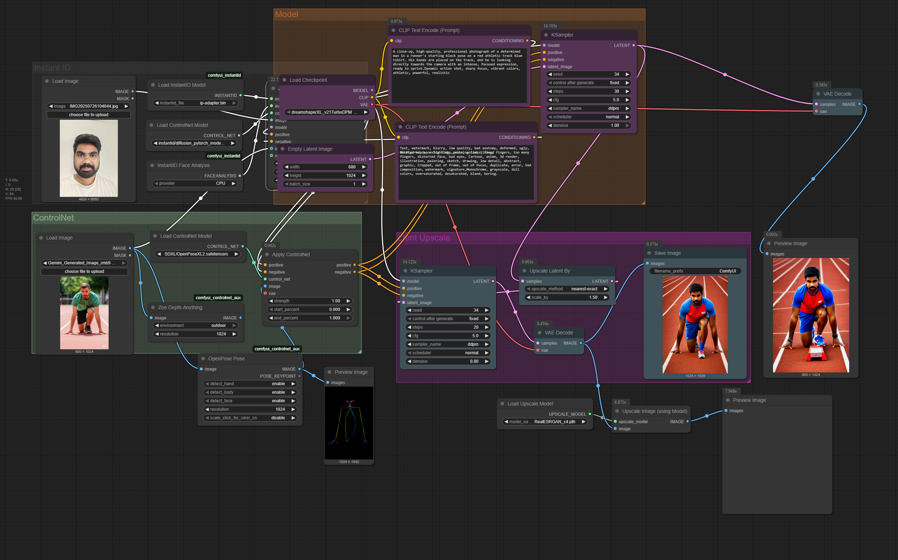
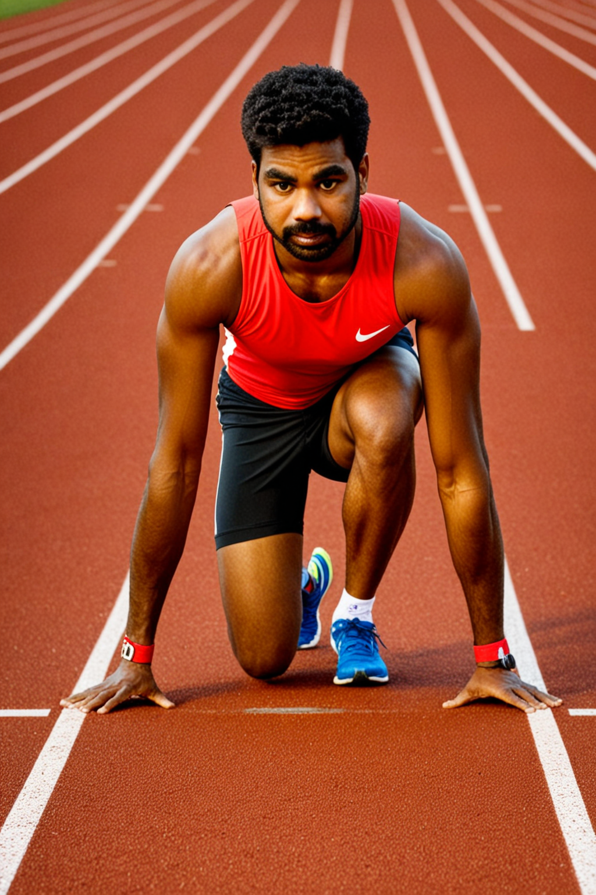

# Advanced Image Generation Techniques

### Workflow Description

This ComfyUI workflow demonstrates a process for generating and enhancing an image based on a source image and a control model. It is designed to take a reference photo of a person and a control image (likely a pose) and use them to create a new, high-quality image of that person in the specified pose, with a custom background and style.

The workflow uses a **ControlNet** model to guide the image generation, ensuring the pose from the control image is accurately transferred to the final output. It also includes an **upscaling** step to improve the resolution and detail of the final image.

### Key Features of the Workflow

* **Image-to-Image Generation**: Uses a user-provided initial image and a ControlNet image to guide the generation process.
* **ControlNet Integration**: Employs a **ControlNet model** (specifically `diffusers_xl_canny_full_v10.safetensors` and `ControlNet-Canny.safetensors`) to precisely control the pose and composition.
* **Prompt-Driven Styling**: Utilizes a text prompt to define the scene, style, and details of the final image, such as "a man at a running race."
* **Two-Pass Upscaling**: The workflow includes an upscaling phase, using a model like `SwinIR_4x.safetensors`, to enhance the image quality and resolution after the initial generation.
* **Reusable and Modular**: The node-based structure of ComfyUI allows users to easily swap out models, change prompts, or adjust settings to achieve different results.

This workflow is ideal for creating custom portraits or stylized images where you need fine-grained control over the subject's pose and appearance.

##WORKFLOW

##EXAMPLE

